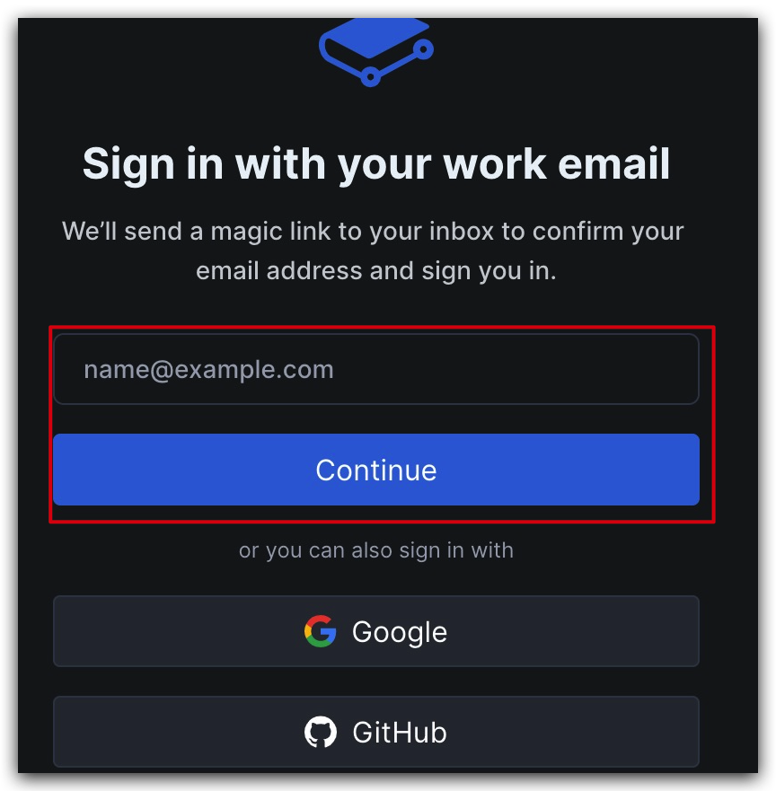

# 使用 Gitbook 写你的电子书

**别怕！一点都不难，不需要敲一行代码，只是一个简单的注册以及操作指引**

[Gitbook 注册链接](https://www.gitbook.com)

使用邮箱注册

注册私人账户

下面这个不重要，随便选或者不选都行

创建之后，可以写章节名字

拖动移动，就可以转移到不同章节

文章写完之后，点击 「Publish」，这是「发布」的意思

点击发布之后，要先做账户认证

这里简单来说就是你得绑定两种登陆方式，绑定完成之后，可以点击「Public」，就可以公开发表了

点个确认就完成了，下面这个链接就是你书籍的网址，之后你可以随时修改自己的书籍内容

笑来老师的《新生 - 七年就是一辈子》就是通过 Gitbook 发布的

[https://b.xinshengdaxue.com/index.html](https://b.xinshengdaxue.com/index.html)

后面点这个 「edit」就行了

***

其它要说的地方：你需要有一个谷歌的账户，注册需要翻墙，要想想办法，

也可以使用 github 注册，这些产品注册唯一的困难其实就是英语，可以找一些可以翻译的浏览器来处理，后面也会再写教程。

